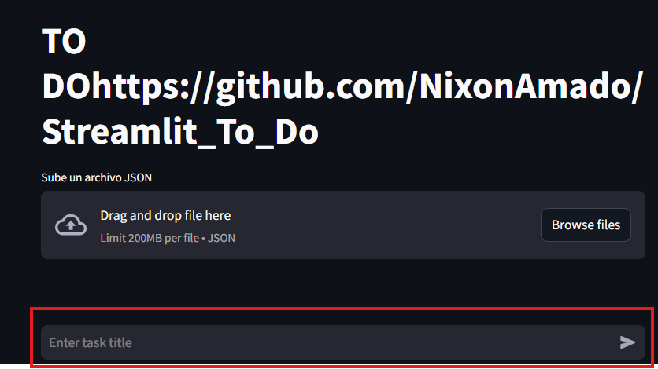
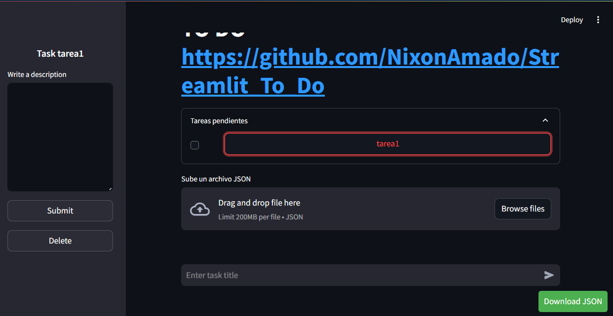
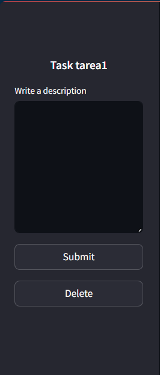
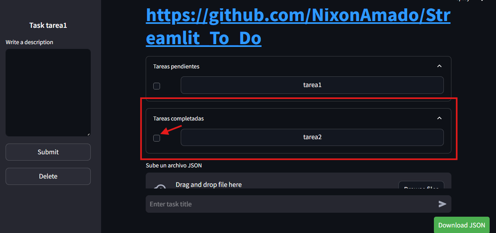
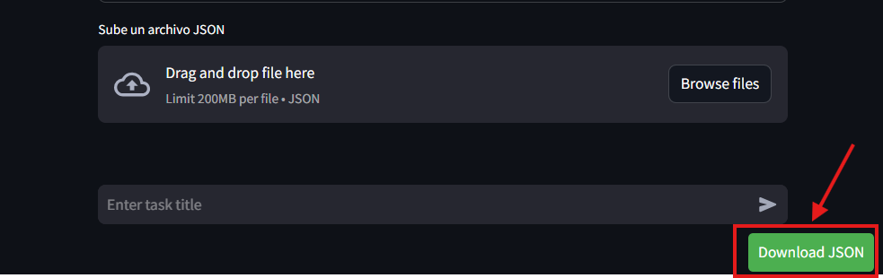
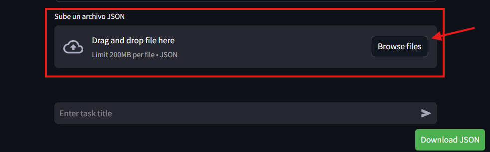

# Streamlit_To_Do
Este es un proyecto de aplicación web para gestionar tareas, desarrollado con Streamlit y SQLAlchemy.

La aplicación ya se encuentra desplegada, por lo cual, solo se explicara el uso de ella

Para crear una tarea donde se requiere un título y una descripción abran dos pasos:

escribir un título

Aparecera una lista con la tarea en pendiente
- si le damos al boton, se cargará la información relacionada a la tarea, como la descripción y la función delete

En el sideBar, tenemos la opción de escribir y almacenar una descripción, así mismo, también la opción de eliminar

Para pasar una tarea de pendiente a completada, se deberá hacer click en el checkbox, el cual  redirigira a la lista de tareas completadas.
De igual manera, se puede pasar de **completada** a **pendiente** de la misma manera

Para exportar las tareas generadas, se debe hacer click en el boton "Download JSON" el cual generará un archivo Json 

Una vez cargado el archivo json, podremos importarlo dando click en el boton Browse files, o arrastrando y pegando

El cual cargará las tareas en sus respectivas secciones, siendo estas, "tareas pendientes" o "tareas completadas"

Ha sido un gran aprendizaje, el cual sé que será muy útil, ya que la combinación de streamlit con sqlAlchemy hace que trabajar con Python sea mucho más sencillo